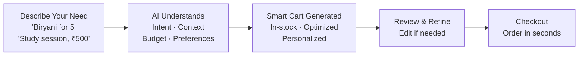
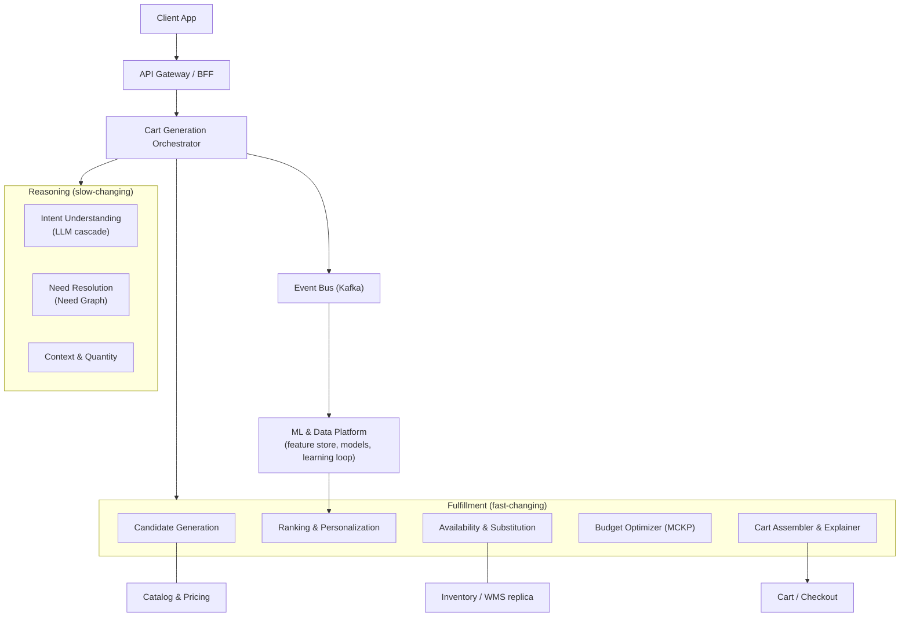
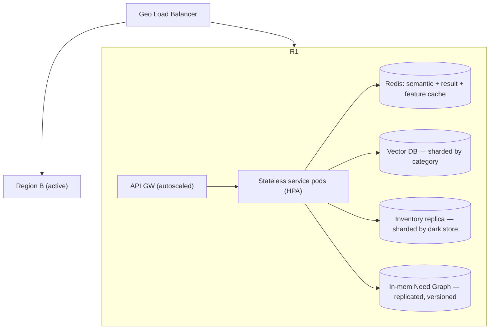
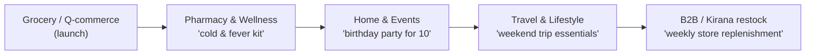

# Amazon Now — Reimagining Urgent Shopping
### Product Requirements Document: Intent-to-Commerce Engine

> **One-line:** Customers describe a need in plain language and instantly get a ready-to-checkout cart — personalized, correctly sized, in-stock, and within budget.

---

## 1. Problem Statement & Relevance

### The Problem
Quick-commerce customers arrive with an urgent need and expect to finish buying in seconds. Yet today they still have to search, browse, compare, and build a cart by hand before they can check out. Finding products and deciding what to buy is the biggest source of friction — even on platforms built for instant delivery. Often, the time spent assembling a cart matches or exceeds the delivery time itself, creating a gap between fast fulfillment and effortless buying.

### Why It Matters
Quick commerce is now a mainstream channel, serving over **20 million** online shoppers in India and making up **more than two-thirds of all e-grocery orders in 2024**. As millions depend on instant commerce for urgent needs, every extra decision step adds friction. It slows the order down and, worse, causes customers to abandon or delay purchases as they lose interest mid-decision. Left unsolved, the experience stays limited by *decision effort* rather than delivery speed — capping the full potential of quick commerce.

### Theme Alignment
This directly answers the **Amazon Now** challenge: help customers *discover, decide, and purchase* in the fastest, most effortless way possible. Instead of search-browse-build, customers state a need in natural language and receive a ready-to-checkout cart matched to their intent, context, and constraints. By removing the decision work, we make **shopping as fast as delivery**.

### What Makes This Novel
Most platforms are **product-first**: you search for products, then build a cart. Our solution is **intent-first**: you describe an *outcome*, and the system turns it into a complete, optimized cart. The core insight — **customers think in goals and situations, not SKUs** — unlocks a fundamentally different experience that removes both product discovery and manual cart-building.

---

## 2. Customer & Solution

### Target Customer
Urban quick-commerce shoppers with an immediate need who want to buy with as little effort as possible. They value speed and convenience but today lose time searching, browsing, and deciding before they can order.

### How We Solve It
We turn shopping from a product-search task into an **intent-driven** one. The customer describes what they need in plain language, and the system builds a personalized, ready-to-checkout cart based on their intent, context, budget, and real-time inventory. They can accept it instantly or adjust it with simple conversation ("make it cheaper", "for 8 people", "no caffeine").

### Key Features

| # | Feature | What it does |
|---|---------|--------------|
| 1 | **Intent-Based Shopping** | Customers describe a goal or situation (*"biryani for 5"*, *"study session tonight, ₹500"*) instead of searching for individual products. |
| 2 | **AI-Generated Smart Cart** | Turns the intent into a complete, ready-to-checkout cart in seconds. |
| 3 | **Context & Quantity Intelligence** | Sizes the cart for *who it's actually for* — an individual order from a 5-person household is not scaled to 5. |
| 4 | **Personalization** | Tailors items using preferences, purchase history, and recency-weighted shopping patterns. |
| 5 | **Real-Time Availability & Smart Substitutions** | Adds only in-stock items, and proposes smart substitutes when something is out of stock. |
| 6 | **Explainable & Editable** | Every line shows *why* it was added, and every edit becomes a learning signal. |

> **Design note:** Quantity sizing is called out as its own feature because getting it right is the hardest trust problem in quick commerce — a wrong quantity breaks trust faster than almost anything. We also treat **Explainable & Editable** as a first-class feature, since clear reasons and one-tap edits are what build trust and feed the system's learning loop.

### User Workflow

---

## 3. Tech Architecture & Scaling

### Architecture

The system follows one core reasoning flow — **Intent → Needs → Constraints → Cart** — and is built around a key split: **slow-changing reasoning** (what a need *means*) is kept separate from **fast-changing fulfillment** (live prices and stock). This lets the expensive AI layer stay stable while the catalog and inventory change every second.

**How a request flows:** the prompt becomes a typed intent (served from cache, then a small model, then a large model only if needed) → needs are resolved from the Need Graph → quantities are sized for the real number of consumers → in-stock candidates are ranked and personalized → the budget optimizer picks the best feasible cart → the assembler prices it, explains each line, and streams the essentials to the screen first.

### Tech Stack

| Layer | Technology | Why |
|-------|-----------|-----|
| **Frontend** | React / React Native | Fast, streaming UI; cross-platform and mobile-first for quick commerce |
| **Backend** | Go / Rust (low-latency services) + Python (ML) | Sub-second fan-out for orchestration and retrieval; Python for model training and serving |
| **Intent (LLM)** | Self-hosted distilled model (common cases) + hosted frontier model (rare cases), e.g. Amazon Bedrock | Balances cost and latency; closed-world rules guard against hallucination |
| **Knowledge** | Need Graph (property graph) + in-memory snapshots | Versioned, governed reasoning served from memory in under a millisecond |
| **Data / ML** | Vector DB (HNSW), Feature Store, Model Registry | Personalized recall, consistent training/serving, safe model rollout |
| **Cache** | Redis cluster (semantic + result + feature) | Deflects 60-70% of LLM calls; sub-millisecond reads |
| **Streaming** | Kafka + Flink | Durable event log; near-real-time learning loop |
| **Infra** | Kubernetes + autoscaling, multi-AZ / multi-region | Stateless horizontal scaling and resilience |

### Key Algorithms & Complexity

| Stage | Approach | Complexity | Why this choice |
|-------|----------|-----------|-----------------|
| **Intent understanding** | 3-tier cascade: semantic cache → distilled model → frontier model, with JSON-schema constrained output | Cache `O(1)` lookup; model runs only on a miss | Cuts cost and latency; closed-world schema blocks hallucinated or unsafe intents |
| **Need resolution** | Graph traversal over an in-memory Need Graph (depth ≤ 3) | `O(V+E)` on a tiny subgraph (sub-ms) | Deterministic, testable, and versioned independently of the catalog |
| **Candidate generation** | Hybrid recall: ANN vector search + purchase affinity | `O(log N)` ANN | Personalized and fast across 300k SKUs |
| **Ranking** | Learning-to-rank + contextual bandit (for exploration) | Linear in candidates | Recency-weighted preference; learns continuously |
| **Cart selection** | Multiple-Choice Knapsack (budget + dietary + essentiality) solved with DP | `O(G·K·B)` ≈ milliseconds | One auditable objective for budget, diet, and substitution; principled order for dropping items |

> **Why it's not just CRUD:** the cart is the answer to a *constrained optimization*, not a simple list. Budget, diet, allergens, pack sizes, and which items are essential are all expressed as constraints in a single solvable objective. New business rules become new constraints — not tangled, one-off code.

### Scaling Strategy

Handling **100x–1000x** growth rests on five levers:
1. **Stateless horizontal compute** — every service autoscales; state lives in Redis, sharded stores, and the in-memory graph. This gives linear scale-out.
2. **Layered caching** — the semantic intent cache deflects 60-70% of LLM calls, while need-plan and cart-template caches reuse work across similar users.
3. **Sharding by locality** — inventory by `dark_store_id`, vectors by category, profiles by `user_id` — so regional spikes stay isolated.
4. **Async learning** — all learning and analytics run through Kafka, so the request path never waits on them.
5. **LLM economics** — the model cascade, batching, and off-peak precomputation of top intents per store keep large-model calls under **35%** of requests.

*Illustrative capacity:* ~8M DAU × 3 generations ≈ ~280 RPS on average and ~3–4k RPS at peak; with ~65% cache deflection, only ~1–1.4k RPS reach the model tier. **Multi-region active-active** turns a single-region service into a global platform.

---

## 4. Future Vision

### Where This Goes
In 1–3 years, intent-first becomes the **default front door** to commerce — not a feature next to search, but the main way people shop for anything urgent. The same Need Graph and reasoning engine that powers groceries extends to any domain where customers think in outcomes rather than products: pharmacy, meal kits, events, and travel essentials. Over time it becomes **proactive** — suggesting the right cart before the customer even types ("rain tonight → umbrella + hot snacks").

### Roadmap

| Horizon | Milestone | Impact |
|---------|-----------|--------|
| **0–3 mo** | Deterministic MVP: Need Graph (top 50 intents), quantity engine, in-stock filtering, greedy budget fill — piloted with a small store cohort | Prove the approach end-to-end; measure cart-acceptance and edit rate |
| **3–6 mo** | LLM intent understanding (cascade + guardrails), MCKP optimizer, ranking v1, smart substitutions | Real natural-language goals turned into principled, personalized carts |
| **6–12 mo** | Online learning loop, refine flow, multi-region scale, proactive intent suggestions | Self-improving carts; serve millions at peak with cost and correctness SLOs |

### Multi-Segment Expansion
The **intent → needs → cart** approach is domain-agnostic, giving a clear expansion path:

Each new segment reuses the same engine — only the Need Graph ontology and catalog change.

### Value Impact
- **Customers:** cart-building time drops from minutes to seconds — shopping becomes as fast as delivery, for **tens of millions** of users.
- **Business:** higher conversion (less mid-decision drop-off), larger correctly-sized baskets (higher AOV), and fewer cancellations thanks to soft-availability checks and substitutions.
- **Platform:** one reasoning engine reused across grocery, pharmacy, events, and B2B — a compounding, multi-segment growth lever rather than a single feature.
