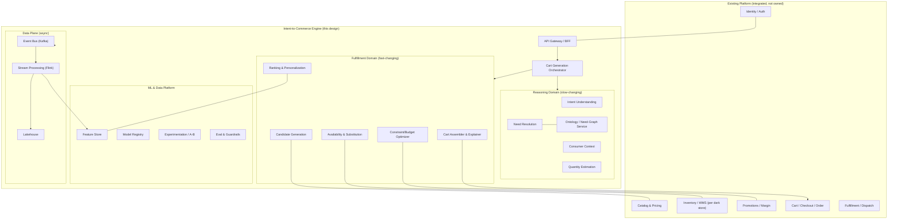
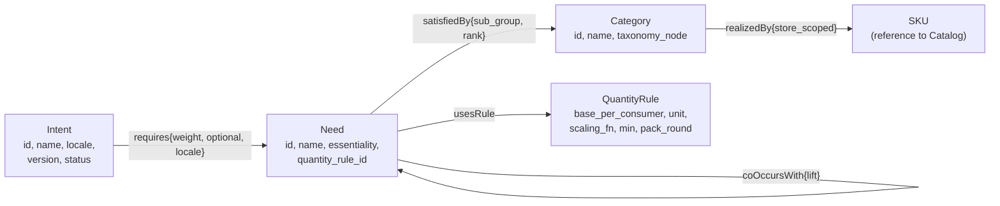
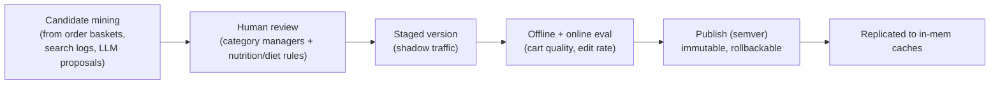
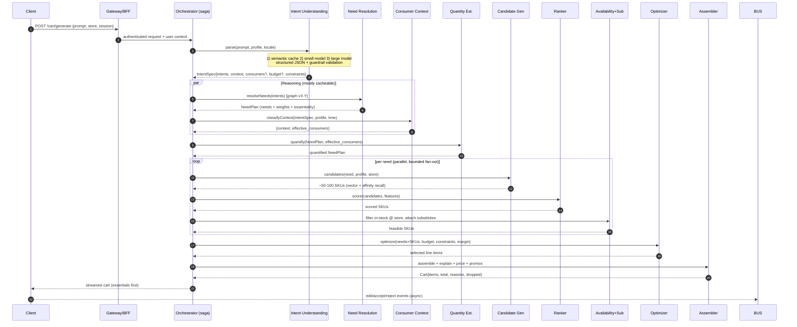
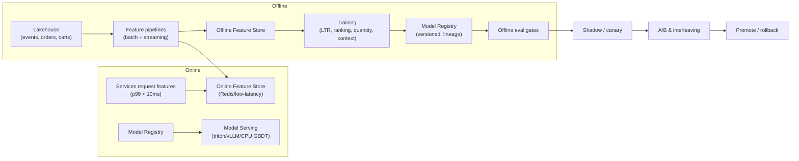
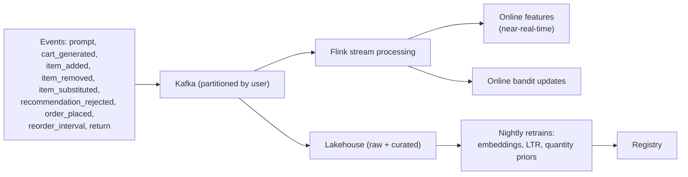
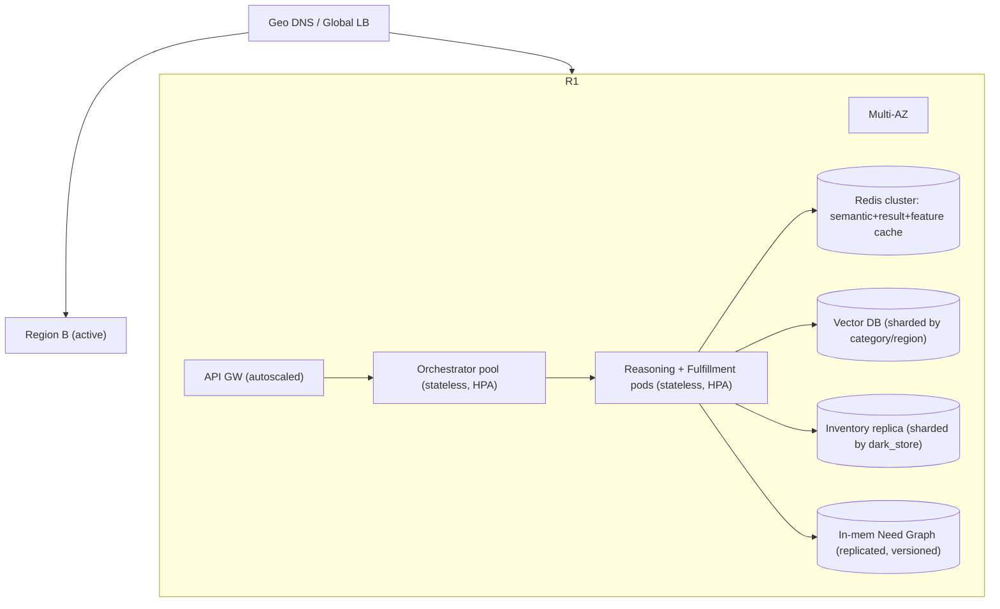

# Intent-to-Commerce Engine — Production System Design

**Author's framing:** This is a design for a real, revenue-bearing platform operated by a quick-commerce business at the scale of tens of millions of users, hundreds of dark stores, and a catalog in the hundreds of thousands of SKUs. It is written to be *operated*, not just demoed — so it treats inventory correctness, ML lifecycle, reliability, privacy, and unit economics as first-class concerns, not footnotes.

---

## 0. Scope, Assumptions, and Non-Goals

### 0.1 What this system is
A platform capability that lets a customer express a **goal in natural language** ("biryani for the family", "study tonight, ₹500") and receive a **ready-to-checkout cart** that is personalized, correctly sized, in-stock at their fulfilling dark store, within budget, and explainable. It sits *alongside* (not replacing) traditional search/browse, and feeds the existing cart/checkout/fulfillment systems.

### 0.2 Working assumptions (stated so they can be challenged)
- **Existing platform exists.** There is already a catalog service, pricing/promotions, an order/checkout system, a dark-store/last-mile fulfillment system, identity, and payments. This engine *integrates* with them; it does not reinvent them.
- **Scale targets:** 20M MAU / ~8M DAU, ~2–4 intent-cart generations per active user per day, p99 budget for cart generation **≤ 1.5s** (cache miss) and **≤ 300ms** (cache hit). Catalog ~300k SKUs, ~1–2k dark stores, each carrying a 8–15k SKU subset.
- **Geography:** India-first (DPDP Act, INR, vegetarian/Jain/Halal dietary norms, regional cuisines), architected for multi-region expansion.
- **The LLM is a dependency, not the product.** It is used narrowly and defensively. The system must be correct and fast even when the model is wrong, slow, or down.

### 0.3 Non-goals
- Not building the LLM itself; we consume hosted + self-hosted models.
- Not replacing keyword search or category browse.
- Not a recipe/content CMS (though it consumes structured recipe/intent knowledge).
- Not the order-fulfillment/rider-dispatch system.

### 0.4 Product principles that drive architecture
1. **Customers think in outcomes, not products.** The system reasons over needs.
2. **A wrong cart is worse than a slow cart, which is worse than a generic cart.** Trust is the product. Quantity errors and out-of-stock items destroy trust faster than anything.
3. **Every line item must be explainable** ("added because you usually buy this / to fulfill the *protein* need / substituted because X was out of stock").
4. **The customer is always in control.** The AI proposes; the human edits, and every edit is a training signal.

---

## 1. The Core Abstraction (refined for production)

```
Intent  →  Needs  →  Constraints  →  Candidate Fulfillment  →  Optimized Cart  →  Feedback
```

I add **Constraints** explicitly between needs and fulfillment, because in production the cart is the solution to a *constrained optimization*, and constraints (budget, diet, allergies, store inventory, pack sizes, margin floors, promo eligibility) are where most real-world correctness lives.

**Why the indirection is non-negotiable at production scale:** needs change on the order of *months* (the ontology), while SKUs, prices, promos, and stock change on the order of *seconds*. Binding intent directly to SKUs would couple a slow, expensive, hard-to-test reasoning layer to the highest-churn data in the company. The abstraction lets us:
- version and test the *reasoning* independently of the catalog,
- swap fulfillment data freely (new SKU, price change, stockout) with zero change to intelligence,
- reuse the same need-graph across search, recommendations, and merchandising.

### Domain glossary (ubiquitous language)
| Term | Definition |
|---|---|
| **Intent** | A canonical, versioned outcome the customer wants (`PrepareBiryani`, `LateNightStudy`). |
| **Need** | An abstract, product-agnostic requirement of an intent (`Protein`, `Energy`, `WritingMaterial`). |
| **Category** | A merchandising grouping that can satisfy a need (`Coffee`, `Basmati Rice`). |
| **SKU** | A concrete, store-scoped, priced, stock-tracked sellable unit. |
| **Consumption Context** | `individual` \| `household` \| `group/guests` — *who the order is for*. |
| **Effective Consumers** | The count used for quantity scaling, ≠ household size. |
| **Substitutability Group** | Set of categories/SKUs interchangeable for a need. |
| **Need Plan** | The resolved, quantified set of needs for a request (intermediate artifact). |

---

## 2. System Context & Bounded Contexts



### Service decomposition rationale
- **Reasoning vs Fulfillment split mirrors the data churn boundary** (§1). They scale, deploy, and fail independently.
- **Ontology/Need-Graph is its own service with its own datastore and editorial workflow**, because it's a governed knowledge asset maintained by humans + automation, not application state.
- **ML & Data Platform is shared infrastructure**, not per-service, to avoid each team reinventing feature pipelines, registries, and experiment frameworks.
- **The Orchestrator is the only stateful-per-request component** (saga state); everything it calls is stateless and horizontally scalable.

---

## 3. The Need Graph — Production Knowledge Asset

The Need Graph is the heart of the system and the thing that justifies the whole architecture. In production it is a **governed, versioned, multi-source knowledge graph**, not a static config file.

### 3.1 Schema (property graph)



**Edge semantics that matter in production**
- `requires(weight, optional)` — drives priority under constrained budget and *drop order*. `optional=true` needs are sacrificed first.
- `satisfiedBy(sub_group, rank)` — defines substitutability and a default preference order before personalization.
- `realizedBy` is **store-scoped and materialized**, not stored in the graph itself — the graph references catalog categories; SKU resolution happens at request time against the live catalog so the graph never goes stale.
- `coOccursWith(lift)` — learned associations (people preparing biryani often also buy raita ingredients) used for *need discovery*, gated by confidence.

### 3.2 Ontology lifecycle & governance (the part most designs skip)
A knowledge graph rots without an operating model. We run it like a product:



- **Versioned (semantic versioning), immutable, rollback-able.** Every cart records the graph version that produced it → full reproducibility for debugging and audits.
- **Bootstrapped, then learned.** Seed intents/needs from chefs, nutritionists, and category managers; then *mine candidate intents/needs* from real basket co-occurrence and search logs, with an **LLM proposing** and a **human approving**. This is how the catalog of intents grows from dozens to thousands without a hallucinated "study session needs cigarettes" slipping into production.
- **Locale-aware.** `requires` edges carry locale so "breakfast" resolves differently across regions; dietary constraints (veg/Jain/Halal) are modeled as need/category attributes, not hacks.
- **Size & cost:** 10⁴–10⁵ nodes — small enough to hold fully in memory in every reasoning pod, replicated read-only, refreshed via versioned snapshots. Traversals are sub-millisecond.

---

## 4. Cart Generation Pipeline (end-to-end)



**Production behaviors baked in:**
- **Streaming response:** essentials (rice, protein) are resolved and streamed to the UI first; nice-to-haves fill in. Perceived latency ≪ actual.
- **Per-stage deadlines & fallbacks** (see §10). The saga is designed so any single stage can fail without failing the request.
- **Idempotency:** `(user, prompt-hash, store, graph-version, time-bucket)` is the idempotency key; retries never double-generate.
- **Every cart is reproducible:** it stores its inputs, the graph version, model versions, and experiment assignments.

---

## 5. Subsystems in Detail

### 5.1 Intent Understanding (defensive LLM productionization)
**Job:** free text → typed `IntentSpec`. Nothing more. It does *not* pick products.

```json
{
  "intents": [{"id":"PrepareBiryani","confidence":0.93}],
  "modifiers": ["stationery"],
  "consumption_context": "household",
  "expected_consumers": 5,
  "budget": {"amount": 1200, "currency": "INR"},
  "dietary": ["non_veg"],
  "explicit_items": [],
  "ambiguities": []
}
```

Production decisions:
- **Constrained decoding / JSON-schema (function-calling) output**, validated against a schema. Anything that fails validation or references an **unknown intent** is rejected — the model can only emit intents that exist in the current graph version (closed-world). This is the primary hallucination guardrail.
- **3-tier model cascade** for cost & latency:
  1. **Semantic cache** — embed prompt, ANN match ≥ τ against recent parses → reuse (≈60–70% deflection on head intents).
  2. **Small fine-tuned model** (self-hosted, e.g. a 7–8B class model distilled on our labeled intents) handles the common case.
  3. **Large hosted model** only for novel/ambiguous/multi-intent prompts.
- **Disambiguation over guessing.** Low-confidence or conflicting signals (e.g. group size unknown for "guests tonight") produce a single, cheap clarifying chip in the UI rather than a wrong cart. One question max; default sensibly if skipped.
- **Continuous eval:** a golden set of labeled prompts runs in CI; online, we track parse-acceptance and downstream edit rate per model version. Models are promoted via the registry only after passing offline + shadow online gates.
- **Abuse/safety filtering** at this boundary (prompt injection, restricted-goods intents like alcohol/tobacco age-gating, unsafe requests).

### 5.2 Need Resolution
Multi-source traversal over the in-memory graph: from each matched intent, collect `requires` needs (depth ≤ 3), **merge across intents** with weight aggregation, and pull in high-confidence `coOccursWith` needs (need discovery) above a confidence gate. Output is a `NeedPlan` with per-need weight and essentiality. `O(V+E)` on a tiny subgraph; deterministic and unit-testable.

### 5.3 Consumer Context & Quantity Estimation (where trust is won or lost)
This is the subsystem most designs get wrong, and the brief specifically calls out (individual order from a 5-person household must not scale to 5).

**Consumer context classifier** — a lightweight gradient-boosted/calibrated model over `{intent type, prompt cues, time-of-day, day-of-week, profile, historical context per intent}` → `{context, effective_consumers}` with a confidence. Rules backstop the model for safety (e.g. personal-consumption intents like "study", "gym" default to `individual=1` regardless of household size).

**Quantity estimation** is a real ML problem, not a constant:
```
qty(need) = base_per_consumer(need)            // from QuantityRule, learned
          × effective_consumers                // from context, NOT household size
          × intent_multiplier(intent, need)    // "feast" vs "snack"
          × personal_consumption_factor(user)  // learned per-user appetite
then snap to nearest purchasable pack size (pack_round), enforce min/max.
```
- `base_per_consumer` and `intent_multiplier` start as nutritionist/category-manager priors and are **continuously re-estimated** from actual post-purchase signals: re-order interval (did they run out / over-buy?), returns, and explicit "too much/too little" feedback.
- Quantities live at the **need level**, so they're consistent regardless of which SKU is chosen, and stable across catalog churn.
- **Guardrails:** hard min/max per need-category to prevent absurd quantities (a model error can't put 40kg of rice in a single-person cart).

### 5.4 Candidate Generation (hybrid retrieval)
For each need-category, recall ~50–100 SKUs via **two fused channels**:
1. **Vector recall** — ANN (HNSW) over SKU embeddings near the user's **taste vector projected into the category**. Embeddings encode brand, price tier, attributes, dietary flags, co-purchase behavior. `O(log N)`.
2. **Affinity recall** — the user's previously purchased/added SKUs in this category (strong personalization signal).

Hard pre-filters applied here, *not* later: dietary (veg/Jain/Halal), allergens, age-restricted goods, and **store catalog membership** (only SKUs the dark store can carry). Retrieving infeasible candidates wastes the whole downstream budget.

### 5.5 Ranking & Personalization
A learning-to-rank model scores candidates:
```
score = w1·affinity(user,sku)        // recency-weighted purchase frequency: Σ e^(−λ·Δt)
      + w2·LTR_relevance(features)   // GBDT / two-tower / DLRM over rich features
      + w3·exploration(sku)          // contextual bandit (Thompson sampling)
      − w4·rejection_penalty(user,sku)// learned dislikes from removals/rejections
      + w5·business_prior(sku)        // freshness, margin, promo — bounded, transparent
```
- **Recency-weighted affinity** is what makes "Green Tea overtakes Energy Drink" emerge naturally as the user keeps adding one and removing the other.
- **Contextual bandit** balances exploit (favorites) and explore (new SKUs), updated online from the event stream — this is the continuous-learning requirement, made concrete and bounded so exploration never tanks experience.
- **Business priors are explicit and capped** so margin/promo influence is auditable and never silently overrides customer preference (trust > take-rate).
- **Cold start:** new users fall back to cohort/popularity priors (by store, time, demographic cohort) and lean more on exploration until a profile forms.

### 5.6 Availability & Substitution (the q-commerce-hard problem)
Inventory in quick commerce is **per-dark-store, fast-moving, and never perfectly accurate**. Treating "stock = available" naively produces canceled items and broken trust.

- **Availability source of truth** is the WMS/inventory service, read through a **low-latency, near-real-time replica** (KV store keyed by `dark_store_id`), updated via inventory CDC events. We also track a **confidence** on each stock count (recently counted vs stale).
- **Soft availability model:** we don't just check `qty>0`; we use `P(available at fulfillment time)` blended from current count, recent sell-through velocity, and replenishment schedule. Low-confidence items are de-prioritized, not silently included.
- **Substitution** walks the SKU's **substitutability group** (same need, ranked) to find the best in-stock alternative that preserves the need and respects user constraints — exactly the Nescafe→Bru case. Substitutions are surfaced transparently and are themselves a learning signal (accepted substitutions improve the group ranking).
- **Reservation, not just check:** at cart-accept the items are soft-reserved against the store to minimize the race between "shown available" and "actually picked." Final reconciliation happens at order placement; if a last-second stockout occurs, the substitution engine proposes a swap rather than dropping the item.

### 5.7 Constraint & Budget Optimization (the formal core)
Selecting the final cart is a **constrained optimization**, modeled as a **Multiple-Choice Knapsack with side constraints**:

```
maximize   Σ_g Σ_i  value[g][i]·x[g][i]            // value = need_weight × rank_score
subject to Σ_g Σ_i  cost[g][i]·x[g][i] ≤ Budget      // budget
           Σ_i x[g][i] ≤ 1            ∀ groups g      // one SKU per need (≤1 ⇒ optional droppable)
           Σ x over essential needs   = required      // essentials must be filled
           dietary / allergen / age constraints satisfied
           margin floor (soft, penalized) respected
           x ∈ {0,1}
```
- **Solver strategy:** exact DP `O(G·K·B)` for typical instances (needs G ≤ ~30, SKUs/need K ≤ ~10, budget bucketed) — milliseconds. For large multi-intent carts or tight latency, a **Lagrangian-relaxation + greedy value-density** approximation with a quality bound.
- **Drop order under tight budget:** optional needs first, then ascending `requires.weight` — so "₹300 study cart" keeps coffee + biscuits and drops the protein bar, while "₹1500" upgrades to premium coffee + energy drink + protein bars. Same intent, different cart, *principled* rather than heuristic.
- **Why MCKP and not rules:** it expresses budget, substitution preference, essentiality, and dietary constraints in one auditable objective. New business rules become new constraints/penalties, not new spaghetti code.

### 5.8 Cart Assembler & Explainability
Final pass: apply live pricing & eligible promotions, compute totals, attach a **human-readable reason per line** ("for the *protein* need • your usual brand • in stock", "substituted: Nescafe → Bru (out of stock)"), list **dropped optional needs** with one-tap add, and emit the cart to the existing checkout system. Explanations are generated from structured provenance the pipeline records — not from a second LLM call — so they're cheap, accurate, and auditable.

---

## 6. ML & Data Platform

A platform, not per-service glue. This is what lets multiple models ship safely and improve continuously.



- **Single feature store, online + offline, with guaranteed train/serve parity** (same definitions, point-in-time correctness) — the #1 source of silent ML bugs, eliminated by design.
- **Model registry with lineage:** every model has a version, training data snapshot, eval scorecard, and is rollback-able. Carts record which model versions produced them.
- **Experimentation as infrastructure:** A/B and **interleaving** for ranking, with guardrail metrics (edit rate, cart-acceptance, stockout-after-accept, AOV, margin). No model reaches 100% traffic without passing canary + experiment gates.
- **LLM evaluation pipeline:** golden prompt sets, automated structured-output validation, hallucination/closed-world checks, and human spot-review on a sampled stream.
- **Drift & monitoring:** feature drift, prediction drift, and business-metric regression alarms; auto-rollback on guardrail breach.

---

## 7. Data Plane & Event Model (the learning loop)

Every meaningful customer action is an event; learning is async and never on the request path.



- **Online signals** (bandit, recency-weighted affinity, recent removals) take effect within **seconds**.
- **Batch signals** (embeddings, LTR weights, quantity priors, ontology mining) refresh **nightly/weekly**.
- This is exactly the brief's requirement — learn from orders, cart modifications, removals, additions, frequency, recency, and rejected recommendations — implemented as a concrete, decoupled pipeline.

---

## 8. Scalability & Performance Architecture



**Scaling levers, in priority order of impact:**

1. **Stateless horizontal compute.** Every service autoscales on QPS/CPU/p95. State lives in Redis, the in-memory graph, and sharded stores. Linear scale-out.
2. **Layered caching (largest cost & latency lever):**
   - *Semantic intent cache* — dedupes the expensive LLM call (60–70% deflection on head intents).
   - *Need-resolution cache* — per-(intent, graph-version) need plans, near-static, cached for hours.
   - *Cart template cache* — `(intent, context, budget-bucket, store, taste-cluster)` reuses generated carts across *similar* users; users are clustered to keep key cardinality bounded.
   - *In-memory Need Graph* in every pod, refreshed by versioned snapshot.
3. **Sharding by data locality.** Inventory sharded by `dark_store_id` (a user reads only their store's shard, isolating regional spikes); vector index sharded by category; profiles/features by `user_id` (consistent hashing).
4. **Async by default.** All learning, analytics, and embedding refresh ride Kafka. The request path never blocks on them; Kafka partitions scale with users.
5. **LLM economics at scale.** Model cascade (cache → distilled small self-hosted → large hosted), request batching, and **off-peak precomputation** of top-N intent carts per store served instantly at peak. Token spend is a tracked SLO with budget alerts.
6. **Multi-region active-active.** Need Graph + models replicate globally; inventory/pricing stay regional. Turns a single-region service into a global platform.

**Illustrative capacity:** ~8M DAU × 3 generations ≈ ~280 RPS avg, ~3–4k RPS peak. With ~65% semantic-cache deflection, ~1–1.4k RPS reach the model tier → a modest self-hosted distilled-model fleet + batching, with the large hosted model handling the long tail. Vector recall (HNSW), graph traversal, and the small MCKP solve are each sub-10ms; the dominant latency on a cache miss is the single model inference.

---

## 9. Consistency & Correctness Model

- **Inventory:** eventually consistent replica for *generation* (read-optimized, with staleness confidence), strongly consistent **reservation** at cart-accept and **reconciliation** at order placement against the WMS source of truth. We accept that "shown" availability is probabilistic and design substitution to absorb the gap.
- **Catalog/pricing:** read-through cache with short TTL; the assembler always re-prices against live pricing before checkout to prevent stale-price orders.
- **Need Graph:** strongly versioned and immutable per snapshot; reads are consistent within a request (the orchestrator pins one graph version for the whole request).
- **Profiles/features:** read-your-writes for the requesting user where it matters (a just-removed item shouldn't reappear in the same session); eventual elsewhere.

---

## 10. Reliability, Availability & Degradation

**SLOs (targets):** cart-generation availability **99.95%**; p99 latency **≤ 1.5s** (miss) / **≤ 300ms** (hit); cart-correctness guardrails (post-accept stockout rate, quantity-complaint rate) tracked as reliability metrics, not just latency.

**Graceful degradation ladder — the request never hard-fails:**
| Failing component | Fallback |
|---|---|
| LLM (all tiers) | Rule/keyword intent match → popular-intent template for that store/time |
| Ranker | Default `satisfiedBy` rank + popularity |
| Vector DB | Affinity + rule recall only |
| Optimizer | Greedy budget fill by value-density |
| Inventory replica stale | Use last-good + raise substitution aggressiveness |
| Feature store | Cohort-level default features |

- **Circuit breakers + bulkheads per dependency**; per-stage deadlines; the orchestrator returns the best cart it can assemble within the latency budget (partial > nothing).
- **Multi-AZ everywhere; multi-region active-active** with health-based geo-routing. **DR:** RPO ≈ minutes (event log + replicated stores), RTO ≈ single-digit minutes (regional failover).
- **Load shedding & prioritization:** under extreme load, shed exploration and degrade to cached templates before shedding requests.

---

## 11. Observability

- **Tracing:** distributed traces across the full saga (one trace per cart generation) with per-stage latency and fallback flags.
- **Metrics:** RED per service + domain KPIs — cart-acceptance rate, lines-edited-per-cart, substitution-acceptance, post-accept stockout, quantity-complaint rate, intent-parse-acceptance, LLM cache-hit %, token spend.
- **Logging/provenance:** every cart logs inputs, graph version, model versions, experiment buckets, and the *reason* for each line → reproducible debugging and audit.
- **Eval dashboards & alerts** on model/business drift with auto-rollback hooks.

---

## 12. Security, Privacy & Compliance

- **Privacy (India DPDP + GDPR-ready):** purpose limitation, consent for personalization, **data minimization** (taste vectors over raw PII where possible), configurable retention, and **right-to-erasure** that propagates to feature store, vectors, and lake.
- **PII handling:** tokenized/segregated PII; models train on pseudonymized features; prompts may contain PII → scrubbed/tokenized before any external LLM call (or kept on self-hosted models).
- **Prompt-injection & abuse defense** at the intent boundary; **age-gating** for restricted goods (alcohol/tobacco) enforced as hard constraints.
- **Fairness:** monitor that personalization/business priors don't create discriminatory or exploitative outcomes (e.g. always upselling certain cohorts); business-prior weights are bounded and audited.
- **Standard controls:** authN/Z at the gateway, least-privilege service identities (mTLS), encryption in transit + at rest, secrets management, audit logging.

---

## 13. Cost Architecture

The dominant variable cost is **LLM inference**; the dominant fixed cost is the **vector + feature serving fleet**.
- LLM cost controlled by the **cache → small self-hosted → large hosted** cascade, batching, precomputation, and per-tenant token budgets with alerting. Target: large-model calls on **< 35%** of requests, trending down as the small model and cache improve.
- Vector/feature serving scaled on read QPS with aggressive caching of hot users/stores.
- **Cost is an SLO:** cost-per-cart-generation is dashboarded alongside latency; regressions page the owning team.

---

## 14. Tech Stack (with rationale; all swappable)

| Concern | Choice | Why |
|---|---|---|
| Service mesh / runtime | Kubernetes + Istio (mTLS, traffic shaping) | Autoscaling, canary, isolation |
| Sync service comms | gRPC | Low-latency typed fan-out |
| Orchestration | Stateful workflow (e.g. Temporal) or custom saga | Timeouts, retries, compensation, reproducibility |
| Need Graph store | Property graph (Neo4j/JanusGraph) + in-mem snapshots | Editorial graph queries; runtime served from memory |
| Vector DB | Milvus/Vespa/pgvector-at-scale | HNSW ANN, sharding, hybrid retrieval |
| Cache / online features | Redis cluster | Sub-ms reads, semantic + result + feature caches |
| Event bus | Kafka | Durable, partitioned, replayable |
| Stream processing | Flink | Stateful streaming features + bandit updates |
| Lakehouse | Iceberg/Delta on object store | Cheap, queryable history, train data snapshots |
| Feature store | Feast-style online/offline w/ parity | Train/serve consistency |
| Model serving | Triton / vLLM (LLM) + lightweight GBDT serving | Throughput + cost control |
| LLM | Self-hosted distilled (common) + hosted frontier (tail) | Cost vs capability |
| Experimentation | In-house A/B + interleaving | Safe rollout |

Languages: **Go/Rust** for low-latency stateless services (orchestrator, retrieval, optimizer), **Python** for ML training/serving glue.

---

## 15. Public API (versioned, contract-first)

```http
POST /v1/cart/generate
  body: { prompt, user_id, dark_store_id, session_id, locale,
          overrides?: { budget?, consumers?, dietary? } }
  200:  { request_id, graph_version, model_versions,
          intents[], consumption_context, effective_consumers,
          cart: [ { line_id, need, sku, qty, unit_price, line_total,
                    reason, substituted_from? } ],
          total, currency, dropped_optional_needs[], experiments[] }

POST /v1/cart/{request_id}/feedback
  body: { added[], removed[], substituted[], rejected[] }   // async learning

POST /v1/cart/{request_id}/refine
  body: { instruction: "make it cheaper" | "more for 8 people" | "no caffeine" }
  // re-runs optimizer/quantity with new constraints, reusing cached reasoning

GET  /v1/intents/suggestions?store=&time=   // proactive intent chips (precomputed)
```
- **Contract-first (OpenAPI/proto), backward-compatible versioning.** Internal calls are gRPC; the public surface is REST/GraphQL via the BFF. **Refine** is a first-class flow — production users iterate ("cheaper", "for 8 people") and we must reuse cached reasoning and only re-optimize.

---

## 16. Testing & Quality for a Non-Deterministic System

- **Deterministic core, tested hard:** need resolution, quantity math, optimizer, substitution are pure functions with exhaustive unit/property tests (e.g. property: *essential needs are never dropped while budget remains*; *quantity never exceeds per-need max*).
- **Golden-set evals** for the LLM boundary in CI (intent accuracy, structured-output validity, closed-world adherence).
- **Scenario regression suite** built directly from product scenarios (individual-vs-household scaling, budget tiers, stockout substitution, multi-intent merge) — these are executable acceptance tests.
- **Shadow + canary + A/B** for every model change; **offline replay** of historical traffic before promotion.
- **Chaos/failure injection** to verify each degradation-ladder fallback actually fires.

---

## 17. Delivery Roadmap (de-risked, value-early)

| Phase | Scope | Goal |
|---|---|---|
| **0 — Foundations** | Need Graph service + seed ontology (top 50 intents), event pipeline, feature store skeleton | Knowledge + data backbone |
| **1 — Deterministic MVP** | Rule-based intent match (no LLM), need resolution, quantity engine, in-stock filtering, greedy budget fill | Prove the *abstraction* end-to-end, instrument edit rate |
| **2 — Intelligence** | LLM intent understanding (cascade + guardrails), MCKP optimizer, ranking v1 | Real NL goals, principled carts |
| **3 — Personalization** | Affinity + bandits + online learning loop, substitution intelligence | Carts get personal and self-improving |
| **4 — Scale & hardening** | Multi-region, semantic cache, precomputation, full degradation ladder, DPDP compliance | Production scale + resilience |
| **5 — Growth** | Automated ontology mining, refine-flow, proactive intents, margin/promo optimization | Compounding quality & business value |

Each phase ships behind feature flags to a small store cohort first, measured on **cart-acceptance and lines-edited-per-cart** before widening.

---

## 18. Top Risks & Mitigations

| Risk | Impact | Mitigation |
|---|---|---|
| Wrong quantities | Trust collapse | Need-level rules + hard min/max guardrails + reorder-interval learning + easy edit |
| Out-of-stock after accept | Cancellations | Soft-availability model + reservation + aggressive substitution |
| LLM hallucinated/unsafe intents | Bad/harmful carts | Closed-world schema (only known intents), safety filter, human-in-loop ontology |
| Ontology rot | Degrading relevance | Governed lifecycle, mining + review, versioning, rollback |
| LLM cost blowout | Margin erosion | Cascade + cache + precompute + cost SLO |
| Over-personalization / filter bubble | Stale carts, missed needs | Bounded exploration (bandit), business-prior caps, fairness monitoring |
| Privacy/regulatory breach | Legal + brand | DPDP-by-design, minimization, erasure propagation, PII scrubbing before external LLM |

---

## 19. Why This Design Holds Up in Production

- **The abstraction isolates volatility** — expensive reasoning is built once and shielded from per-second catalog/inventory churn.
- **Correctness is engineered, not hoped for** — effective-consumer quantity scaling, closed-world intent guardrails, soft-availability + reservation, and an auditable MCKP objective directly address where trust is lost.
- **It learns continuously and safely** — online bandits + nightly retrains on a real event pipeline, gated by experimentation and auto-rollback.
- **It degrades instead of failing** — every dependency has a fallback; the customer always gets a cart within budget.
- **It scales globally and economically** — stateless compute, layered + semantic caching, sharded data, an LLM cost cascade, and multi-region active-active, with cost and correctness treated as SLOs alongside latency.
